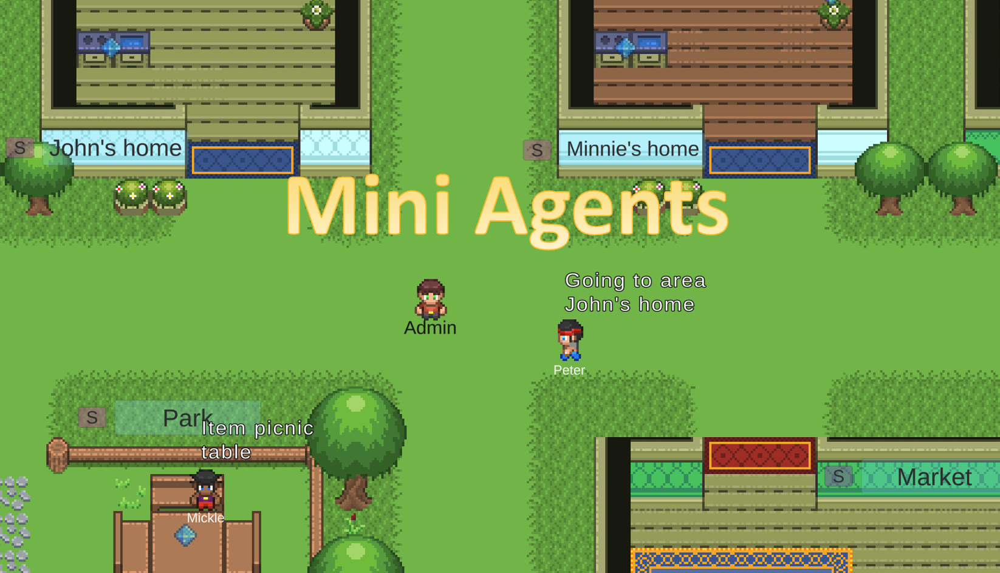
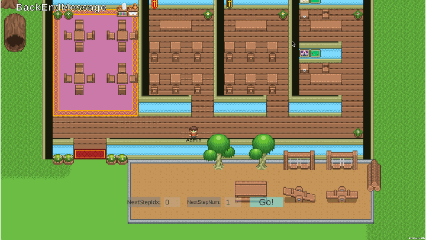

# MiniAgents: A Visualization Interface for Simulacra (Still Work-in-progress)

The MiniAgents visualization tool for simulacra.

I currently work on Mac, but will add support for windows. The project is still work-in-progress (like a 0.5 version), I'm releasing this version because it's already functional.

Disclaimer: So far there is no novelty related to NLP research in this project, it is a tool and not a paper. It is motivated by the "Generative Agents: Interactive Simulacra of Human Behavior" paper.

I'll be happy to answer questions.

Author: Tianxing He (https://cloudygoose.github.io/)

Apr 15 2024: A runnable windows version is uploaded, the root dir should be C:\Users\Username\MiniAgents (the game will show you the root path when it runs). But the backend python files are currently only tested on Mac (but should not be hard to migrate to windows).

Apr 10 2024: Online dialogue with agents in the game is now supported.

## Quick start

**Important: Please download this repo to the path ~/Documents/MiniAgents** . I'm sorry for the inconvenience, somehow it is hard for a unity-complied game to get its current path.

Download MiniAgent.app from the following shared google folder and put it in the repo folder (same folder as this README file, like ~/Documents/MiniAgents/MiniAgents_build.app). You may need to control-click it in the finder otherwise mac won't let you open it.

https://drive.google.com/drive/u/1/folders/1NR30Trp3TqmDPl_dTU7FN660KpR0U-Od

I have put the map files in ./ and 20 steps of random-simulation trajectory files in ./runs/minimal_run0/ . Just click the app file open, press Esc and change the run folder to runs/minimal_run0, press enter to come back to the game. Finally, click the "Go!" button in the game.

Tips:

1. You can change the step idx and number via the in-game buttons.
2. Press Esc to see the main menu, especially buttons for map editting.
3. If you want the admin to run faster, press shift.
4. To zoom in and out, use the scroll on your mouse.

## Run your own simulation

I give a minimal example of how simulation trajectories can be generated for this visualization interface.

The minimal setting only requires python3.11.

To generate another trajectory, go to minimal/ and run

> python backend.py --clear_dir

Please check the runfolder in the game is correct. 

I put a lot of comments in backend.py to explain things. 

## Online dialogue with agents

If you run things in **online** mode, you will be able to communicate with the backend when agents are idle.

Go to minimal, run the following (do not forget the clear_dir option)

>python backend.py --step_wait 1 --clear_dir --online

Now the backend will wait for messages from the frontend before generating new steps.

Now open the game, press Esc to go the main menu and check the "online" toggle. Below is an example:

The messages are handled and responded by the python backend.

## Map editting

You can edit the sectors, areas, and items in the map. Press Esc to see the main menu, especially buttons for map editting.

Below, I show how to draw the grids (which is a rectangle) for a new sector. Remember to use the SaveMap Button after your editting, and make sure that it is loaded by the backend.

Please make sure there is at least one item in each sector or area.

## An example of very basic simulation with LLM agents (work-in-progress)

Please pip install openai==1.17.1

This is still work-in-progress and I borrow some code from https://github.com/joonspk-research/generative_agents .

Go to ./basicllm/ and run the following (use online if you want to have a conversation with the agents)

>python backend_basicllm.py --online --clear_dir --path ../runs/run0_online

And don't forget to set the correct run folder path or the online toggle in the game.
